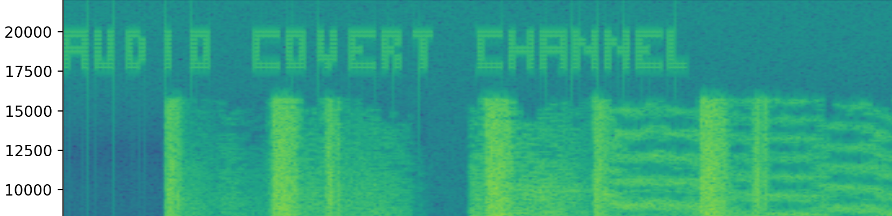

# AudioCovert: Embed and Decode Hidden Messages in Audio Files



## Generative AI Usage. Readme First!

This project was done in a class called AI In Cybersecurity, a class that discussed the emerging generative AI technology and how it can be used to benefit the cybersecurity community. But what is this, a steganography tool coming out of an AI class? 

Well, in this class, we were _assigned_ to make a coding project (of anything) using generative AI. It was basically an experiment to determine how AI-assisted code generation could help people. There has been much controversy has surrounding generative AI. However, this project was an attempt to be forward thinking and look more at the good that can come out of it.

This does not mean at all that this project was done entirely by AI. At least at this time in early 2024, AI code generation is not mature enough to create something like this entirely on it's own. I know for sure we had to spend a lot of time debugging to get this to work. 

Nonetheless, it is a fun proof of concept script. Enjoy reading the AI generated readme below!

## Description

AudioCovert is a sophisticated tool that introduces an innovative approach to secure communication through audio files. This product provides a unique capability to embed hidden messages within WAV audio files, manipulating the audio data in a way that is imperceptible to human ears. By encoding alphanumeric characters into high-frequency signals, it crafts visual messages that are embedded within the audio spectrum. To reveal these hidden messages, one simply needs to generate and inspect the spectrogram of the audio file, allowing for a visual decoding of the embedded message.

## Features

- **Embed Hidden Messages:** Encode textual messages into audio files without affecting the audible quality, making the alterations undetectable by human ears.
- **Visual Message Decoding:** By plotting the audio file's spectrum, the embedded messages can be visually decoded, offering a unique blend of audio and visual data communication.
- **Flexible Message Embedding:** Supports embedding of alphanumeric characters, allowing for a wide range of messages to be securely encoded within the audio.

## Installation

Before running AudioCovert, ensure you have Python installed on your system. AudioCovert is built with Python and requires some dependencies to run correctly. You can install these dependencies using pip:

```bash
pip install numpy matplotlib scipy
```

## Usage

AudioCovert is designed with simplicity in mind, featuring two main functionalities: embedding messages in audio files and plotting audio spectrums for message decoding. Below are the command-line arguments to use these features.

### Embedding a Hidden Message

To embed a message within an audio file, use the `embed` command followed by the necessary arguments:

```bash
python audio_covert.py embed <wav_file> <outfile> --message "Your secret message"
```

- `<wav_file>`: Path to the input WAV file.
- `<outfile>`: Path where the output WAV file with the embedded message will be saved.
- `--message`: The secret message you wish to embed within the audio file.

### Plotting the Audio Spectrum

To plot the audio spectrum of a file, potentially revealing any hidden messages, use the `plot` command:

```bash
python audio_covert.py plot <wav_file> [--xlim X] [--ylim Y]
```

- `<wav_file>`: Path to the WAV file whose spectrum you wish to plot.
- `--xlim`: (Optional) The amount of time in seconds to display in the plot.
- `--ylim`: (Optional) The lower bound of the frequency range to include in the plot.

## Example

Embedding a message:

```bash
python audio_covert.py embed example.wav output.wav --message "Hello World"
```

Plotting the audio file to reveal the message:

```bash
python audio_covert.py plot output.wav
```
